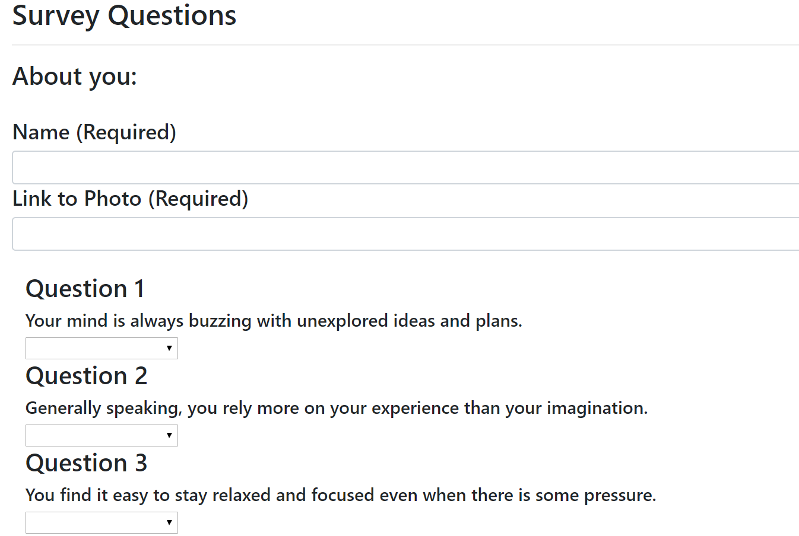
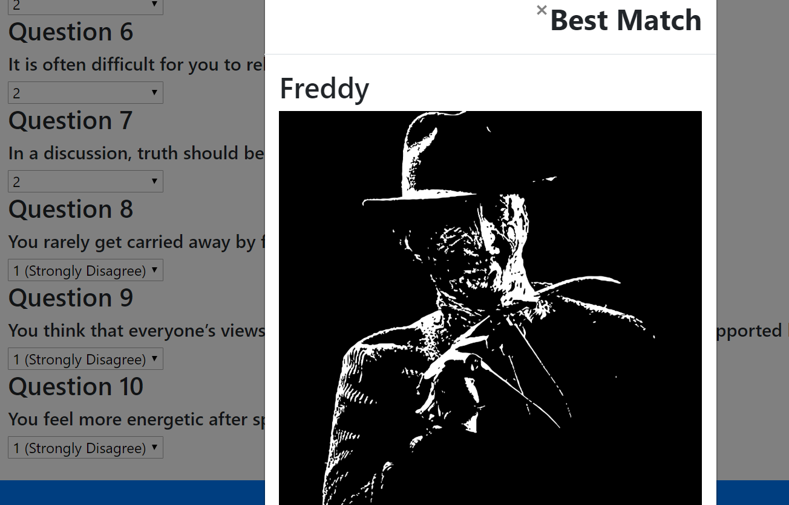
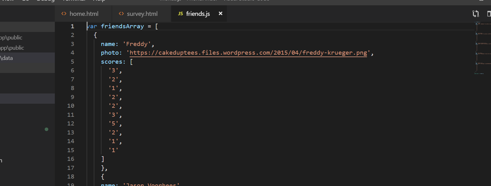
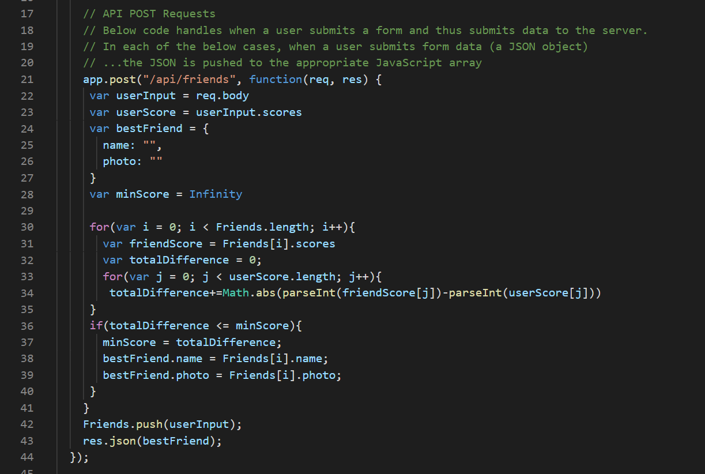

# FriendFinder

This app allows a user to select a range of agreement for survey qestions to match their scores with another 'friend' that has been stored in the app. 

# Need a friend?

FriendFinder uses node.js, express.js, and JavaScript to crete a quiz where users can move from a start page to a survey. The 10 questions allows the user to select a degree of agreement from 1-5 regauding the survey. The stored 'Friends' also has scores set for them. The app compares these scores and outputs the resulting 'match' in a modal that pops up on the screen.

# Detail Functionality:

## Survey fields and example questions:

## A 'friend' match:

## Stored 'friend' code:

## JavaScript comparison code:

